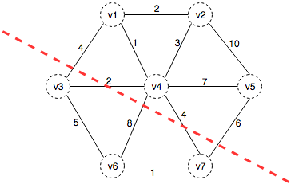
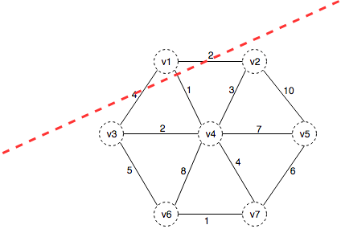

## 最小生成树（Prim算法和Kruskal算法）

《算法导论》书中有讲最小生成树的概念，以及构建最小生成树的两个算法——Prim算法和Kruskal算法。

最小生成树：在一个有n个节点的图中，找出n-1条边把这n个节点连起来。这样就得到了一个生成树（n个节点和n-1条边组成的树）。
当然根据选择边的不同会有很多种这样的生成树，其中使得这n-1条边加起来的长度最小树就是最小生成树。

下面是一个图和他的其中一个生成树（但不是最小的生成树）：

### 如何使得这些边加起来的和最小

考虑如下问题：

现在我们把图分成两个区域，坐下部分是一个区域，右上部分是一个区域，

假设现在这两个区域各自的节点都已经联通，但这两个区域之间没有联通。而生成树是要求所有节点都联通，现在差最后一条线联通这两个区域。很明显这时候选一条最短的联通这两个区域的线就好了。

#### 现在开始真正的产生最小生成树

首先我们假设最终生成的最小生成树中，和v1节点相连的只有一条边。也就是说v1是一个区域，其他所有节点属于另一个区域。现在除了v1的其他节点都已经联通。这时候我们明显应该选v1-v4（与v1相连的最短边）这条最短边，所以v1-v4这条路径一定会在最小生成树里面。

有人可能会问，为什么可以假设在最小生成树中，和v1节点相连的只有一条边？也有可能会有两条边、三个区域啊，像下面这样。v1一个区域，(v3,v6)一个区域，剩下的节点成为一个区域。

完全有可能，还有可能会有3条边、四个区域。但这不影响结果，和v1相连的最短的边将会在最小生成树里面。因为最短边的另一端v4一定是属于其中一个区域的，而v1和这个区域连接肯定会选这条最短的边。

所以，现在我们确定下来v1-v4这条边一定在最小生成树里面。现在我们把(v1,v4)看成一个区域，把其他部分看成另一个区域。同样的方法我们找连接这两个区域最短的边，然后把这个边加进来。以此类推，最终就生成了最小生成树。

这个过程其实就是Prime算法。其实Kruskal算法和Prime算法是一样的思路，只是每次分区的方法不一样。
